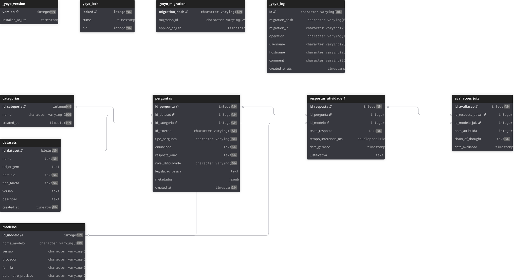
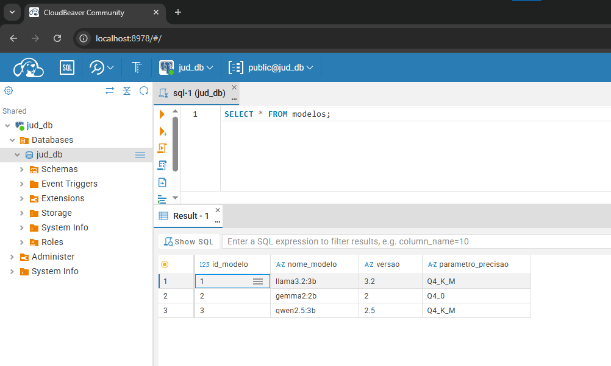
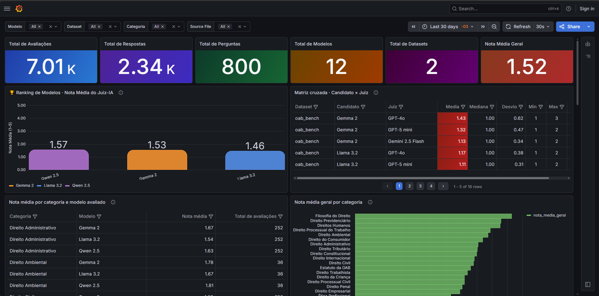

Português | [English](./README-EN.md)

<div align="center">


<h1>Tópicos Avançados ES e SI</h1>

<p>Atividade avaliativa 2: Implementação de framework "LLM-as-a-Judge" e persistência em banco de dados relacional</p>

<p align="center">
  <!-- Python version -->
  
  <!-- PostgreSQL -->
  
  <!-- License -->
  <a href="LICENSE">
    
  </a>
  <!-- Last commit -->
  <a href="https://github.com/ReinanHS/Topicos_Avancados_2026_1_Equipe_JUD_3_atividade2/commits/main">
    
  </a>
  <!-- Stars -->
  <a href="https://github.com/ReinanHS/Topicos_Avancados_2026_1_Equipe_JUD_3_atividade2/stargazers">
    
  </a>
</p>

</div>

<details>
<summary>Sumário (Clique para expandir)</summary>

- [Sobre](#sobre)
- [Apresentação](#apresentação)
- [Colaboradores](#colaboradores)
- [Arquitetura do banco de dados](#arquitetura-do-banco-de-dados)
- [Instruções de execução](#instruções-de-execução)
  - [Pré-requisitos](#pré-requisitos)
  - [Subindo o ambiente com Docker](#subindo-o-ambiente-com-docker)
  - [Acessando o CloudBeaver](#acessando-o-cloudbeaver)
  - [Executando consultas SQL no navegador](#executando-consultas-sql-no-navegador)
- [Pipeline LLM-as-a-Judge](#pipeline-llm-as-a-judge)
  - [Juízes suportados](#juízes-suportados)
  - [Configuração de credenciais](#configuração-de-credenciais)
  - [Executando o avaliador](#executando-o-avaliador)
- [Análise estatística (Spearman)](#análise-estatística-spearman)
- [Contribuições](#contribuições)
- [Licença](#licença)
- [Referências](#referências)

</details>

## Sobre

Este repositório contém as contribuições individuais do aluno **Reinan Gabriel** para a segunda atividade avaliativa da disciplina **Tópicos Avançados em Engenharia de Software e Sistemas de Informação I** (UFS 2026.1).

O projeto dá continuidade à [Atividade 1](https://github.com/ReinanHS/Topicos_Avancados_2026_1_Equipe_JUD_3_atividade1), avançando da inferência básica para uma avaliação estruturada das respostas dos modelos. As frentes principais são:

- **LLM-as-a-Judge:** implementação de um pipeline de julgamento automatizado com rubricas jurídicas (escala 1–5), extração de Chain-of-Thought e uso de modelos juízes para auditar acurácia técnica e fundamentação legal.
- **Persistência em PostgreSQL:** modelagem e implementação de um banco de dados relacional para armazenar o ciclo completo do experimento com datasets, respostas dos modelos candidatos e avaliações do juiz.
- **Análise estatística:** cálculo da correlação de Spearman entre as notas do Juiz-IA e o gabarito humano, com análise de erros e discussão dos resultados.

## Apresentação

> **Em breve.** O link do vídeo de apresentação (10–20 min) será adicionado aqui após a gravação.

O vídeo a seguir mostra os resultados coletados pela equipe para a segunda atividade avaliativa:

[](https://youtu.be/dQw4w9WgXcQ)

- **Assista ao vídeo completo:** [https://youtu.be/dQw4w9WgXcQ](https://youtu.be/dQw4w9WgXcQ)

## Colaboradores

<div align="center">
<table align="center">
  <tr>
    <td align="center">
      <a href="https://github.com/ReinanHS">
        
      </a><br/>
      <a href="https://github.com/ReinanHS">Reinan Gabriel</a>
    </td>
  </tr>
</table>
</div>

---

## Arquitetura do banco de dados

O esquema relacional segue a estrutura sugerida pelo professor, com cinco tabelas principais:

- [Acesse o link para visualizar o diagrama detalhado no DBDiagram.io](https://dbdiagram.io/d/Topicos_Avancados_2026_1_Equipe_JUD_3_atividade2-69e940f2d80a958d1cb60703)



---

## Instruções de execução

### Pré-requisitos

| Requisito | Versão mínima | Descrição |
|-----------|---------------|-----------|
| [Python](https://www.python.org/downloads/) | 3.12+ | Linguagem principal do projeto |
| [Docker](https://docs.docker.com/get-docker/) | 24+ | Containerização dos serviços (PostgreSQL e CloudBeaver) |
| [Docker Compose](https://docs.docker.com/compose/install/) | 2.x | Orquestração dos contêineres |
| [Git](https://git-scm.com/install) | 2.x | Controle de versão |

> **Nota:** O PostgreSQL 17 já é provisionado automaticamente via Docker, não sendo necessário instalá-lo separadamente.

### Subindo o ambiente com Docker

Com o Docker instalado e em execução, basta rodar o comando abaixo na raiz do projeto:

```bash
docker compose up -d
```

Isso irá provisionar automaticamente dois serviços:

| Serviço           | Porta  | Descrição                                        |
|-------------------|--------|--------------------------------------------------|
| **PostgreSQL 17** | `5432` | Banco de dados relacional do projeto             |
| **CloudBeaver**   | `8978` | Interface web para gerenciar e consultar o banco |

Para verificar se os contêineres estão rodando corretamente:

```bash
docker compose ps
```

Para parar o ambiente:

```bash
docker compose down
```

### Instalação e execução

Para executar o projeto de forma local, siga os passos:

```bash
# (Opcional) Criar e ativar um ambiente virtual
python -m venv .venv

# Ativação no Linux/macOS
source .venv/bin/activate

# Ativação no Windows (PowerShell)
# .venv\Scripts\activate

# Instalar as dependências
uv sync
```

## Migrations

```bash
uv run python main.py db rollback
uv run python main.py db migrate
```

## Seeders

```bash
uv run python main.py db seed all
```

### Acessando o CloudBeaver

O [CloudBeaver](https://dbeaver.com/docs/cloudbeaver/) é uma ferramenta web de administração de bancos de dados. Ela já vem configurada automaticamente com a conexão ao PostgreSQL do projeto.

1. Abra o navegador e acesse: [http://localhost:8978](http://localhost:8978)
2. O acesso anônimo já está habilitado, então **não é necessário fazer login**.
3. No painel lateral esquerdo, você verá a conexão **jud_db** já disponível.
4. Clique na conexão para expandir e visualizar as tabelas do banco.

> **Acesso administrativo:** Caso precise de permissões de administrador, utilize as credenciais `cbadmin` / `Admin123`.

### Executando consultas SQL no navegador

Para executar consultas SQL diretamente pelo CloudBeaver:

1. No painel lateral, clique na conexão **jud_db** para selecioná-la.
2. Clique no botão **SQL** na barra superior (ou pressione `Ctrl + Enter` após abrir o editor).
3. No editor SQL que será aberto, digite a sua consulta. Por exemplo:

```sql
SELECT * FROM modelos;
```

4. Clique no botão **▶ Executar** (ou pressione `Ctrl + Enter`) para rodar a consulta.
5. Os resultados serão exibidos na parte inferior do editor em formato de tabela.

Veja o exemplo da imagem abaixo:



---

### Acessando o Grafana

O [Grafana](https://grafana.com/docs/grafana/latest/) é uma ferramenta de visualização de dados. Ela já vem configurada automaticamente com a conexão ao PostgreSQL do projeto.

1. Abra o navegador e acesse: [http://localhost:3000](http://localhost:3000)
2. O acesso anônimo já está habilitado, então **não é necessário fazer login**.
3. No painel lateral esquerdo, você verá a conexão **jud_db** já disponível.
4. Clique na conexão para expandir e visualizar as tabelas do banco.

> **Acesso administrativo:** Caso precise de permissões de administrador, utilize as credenciais `admin` / `admin`.



---

## Pipeline LLM-as-a-Judge

O avaliador (Juiz-IA) lê as respostas geradas na Atividade 1 (tabela `respostas_atividade_1`), submete cada uma a um modelo juiz com a rubrica do Desembargador OAB (escala 1–5) e persiste o veredito (nota + Chain-of-Thought) em `avaliacoes_juiz`.

Arquitetura modular: `BaseJudge` (contrato) → `JudgeFactory` (resolve `provedor:modelo` na instância correta) → implementações concretas para [Ollama](src/services/judges/ollama_judge.py), [Anthropic](src/services/judges/anthropic_judge.py) e [OpenAI](src/services/judges/openai_judge.py). O prompt fica em [prompts.py](src/services/judges/prompts.py) e o parser do veredito em [parser.py](src/services/judges/parser.py). A idempotência é garantida no banco via constraint única em `(id_resposta_ativa1, id_modelo_juiz)`.

### Juízes suportados

| Spec CLI | Tipo | Modelo no banco |
|---|---|---|
| `ollama:llama3.1:8b` | Local (Ollama) | Llama 3.1 |
| `ollama:qwen2.5:7b` | Local (Ollama) | Qwen 2.5 |
| `anthropic:claude-sonnet-4-6` | API | Claude Sonnet 4.6 |
| `openai:gpt-4o` | API | GPT-4o |

Para listar dinamicamente:

```bash
uv run python main.py db judge list-available
```

### Configuração de credenciais

Copie `.env.example` para `.env` e preencha conforme o(s) juiz(es) que pretende usar:

```env
# Para juízes via API (opcionais — só preencha o que for usar)
ANTHROPIC_API_KEY=sk-ant-...
OPENAI_API_KEY=sk-...

# Para juízes locais via Ollama (default é http://localhost:11434)
OLLAMA_HOST=http://localhost:11434
```

Para juízes Ollama, garanta que o modelo já foi baixado:

```bash
ollama pull llama3.1:8b
ollama pull qwen2.5:7b
```

### Executando o avaliador

O comando aceita de 1 a 3 juízes por execução. Repita `-j` para usar múltiplos juízes:

```bash
# Apenas um juiz local (sem custo de API)
uv run python main.py db judge evaluate -j ollama:llama3.1:8b

# Smoke test com limite (útil para validar o pipeline)
uv run python main.py db judge evaluate -j ollama:llama3.1:8b --limit 5

# Multi-juiz (até 3)
uv run python main.py db judge evaluate \
  -j ollama:llama3.1:8b \
  -j anthropic:claude-sonnet-4-6 \
  -j openai:gpt-4o
```

O pipeline pula automaticamente respostas que o juiz informado já avaliou — pode interromper e retomar à vontade sem duplicar custo de API.

---

## Análise estatística (Spearman)

Após popular `avaliacoes_juiz`, o módulo de análise calcula a correlação de Spearman (ρ) entre o juiz e o gabarito humano, conforme a metodologia do enunciado.

```bash
uv run python main.py db analysis run
```

O relatório inclui três blocos:

1. **Resumo agregado** — média, desvio-padrão e contagem das notas por `(dataset, modelo candidato, juiz)`.
2. **Juiz × Gabarito Humano** — para questões de múltipla escolha, converte o gabarito em nota binarizada (`5` se a resposta do modelo contém a alternativa correta, `1` caso contrário) e calcula ρ contra a nota do juiz.
3. **Inter-juízes** — quando houver 2+ juízes avaliando as mesmas respostas, calcula ρ par a par (útil para detectar viés sistemático).

Interpretação rápida (ρ ∈ [-1, 1]):

| Faixa de ρ | Leitura |
|---|---|
| 0.7 – 1.0 | Forte alinhamento — o juiz "pensa" como o gabarito. |
| 0.3 – 0.6 | Alinhamento moderado — a rubrica pode precisar de calibração. |
| < 0.3 | Discordância — achado científico relevante; investigar no relatório. |

> **Nota:** o cálculo do bloco 2 depende do gabarito (`answerKey`) estar presente em `metadados.jsonb` das perguntas de múltipla escolha. Se você populou o banco antes da atualização do [base_extractor.py](src/services/extractors/base_extractor.py), faça `db rollback` + `db migrate` + `db seed all` para recapturar.

---

## Contribuições

Consulte o arquivo [CONTRIBUTING.md](CONTRIBUTING.md).

## Licença

Este projeto utiliza a Licença MIT. Consulte o arquivo [LICENSE](LICENSE) para os termos completos.

## Referências

- [Atividade 1: Repositório da Equipe JUD_3](https://github.com/ReinanHS/Topicos_Avancados_2026_1_Equipe_JUD_3_atividade1)
- [OAB Bench](https://huggingface.co/datasets/maritaca-ai/oab-bench)
- [OAB Exams](https://huggingface.co/datasets/eduagarcia/oab_exams)
- [PostgreSQL Documentation](https://www.postgresql.org/docs/)
- [LLM Evaluation: A Comprehensive Survey](https://arxiv.org/html/2504.21202v1)
- [SciPy: spearmanr](https://docs.scipy.org/doc/scipy/reference/generated/scipy.stats.spearmanr.html)

---

<div align="center">
  <sub>Desenvolvido pela Equipe 3 (Domínio Jurídico) | UFS 2026.1</sub>
</div>
